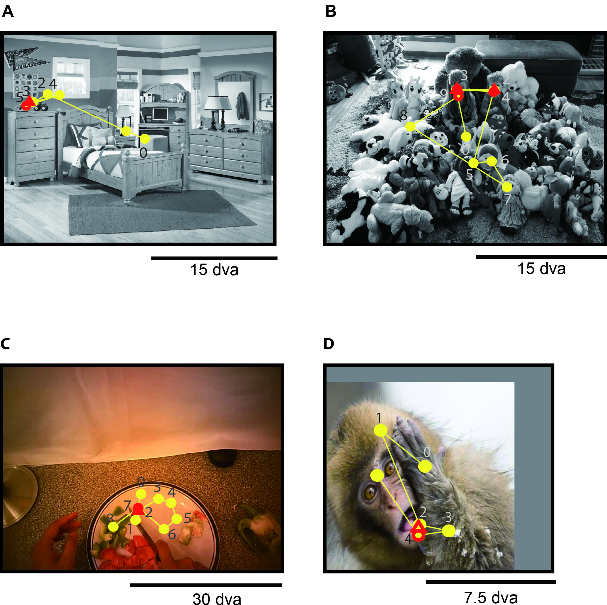

# Look Twice: A Computational Model of Return Fixations across Tasks and Species 

Authors: Mengmi Zhang, Will Xiao, Olivia Rose, Katarina Bendtz, Margaret Livingston, Carlos Ponce, and Gabriel Kreiman

This repository contains an implementation of a deep learning model for predicting return fixations and eye movement data across tasks and species. Our paper is published in PLOS Computational Biology, 2022.

## Project Description

Saccadic eye movements allow animals to bring different parts of an image into high-resolution. During free viewing, inhibition of return incentivizes exploration by discouraging previously visited locations. Despite this inhibition, here we show that subjects make frequent return fixations. We systematically studied a total of 44,328 return fixations out of 217,440 fixations across different tasks, in monkeys and humans, and in static images or egocentric videos. The ubiquitous return fixations were consistent across subjects, tended to occur within short offsets, and were characterized by longer duration than non-return fixations. The locations of return fixations corresponded to image areas of higher saliency and higher similarity to the sought target during visual search tasks. We propose a biologically-inspired computational model that capitalizes on a deep convolutional neural network for object recognition to predict a sequence of fixations. Given an input image, the model computes four maps that constrain the location of the next saccade: a saliency map, a target similarity map, a saccade size map, and a memory map. The model exhibits frequent return fixations and approximates the properties of return fixations across tasks and species. The model provides initial steps towards capturing the trade-off between exploitation of informative image locations combined with exploration of novel image locations during scene viewing.


| [](samples/Fig1_v4.jpg)
|:---:|
| Primates make return fixations during natural vision. A fixation (yellow circles) is referred to as a “return fixation” (red triangle) if the Euclidean distance to any of the previous fixations is less than 1 degree of visual angle (dva). The previous fixation overlapping with the return fixation is referred to as “fixation-to-be-revisited” (red circle).| 

## Pre-requisite

The code has been successfully tested on Ubuntu 18.04 with CUDA 11.0 (NVIDIA RTX 2080 Ti). 

It requires Pytorch (python=2.7) for running deep learning models, Matlab 2019 for pre and post processing eye movement data, [psiturk](https://psiturk.org/) for conducting Amazon Mechanical Turk experiments. 

There are 8 datasets in total. Typically in all the source codes, we introduce a variable ```type``` and change it to switch datasets, e.g. ```type = 'os'``` to process relevant data on Egocentric Video 1 experiment as introduced in the paper. Here is a complete list of dataset naming convention:
- array (Human Visual Search 1)
- naturaldesign (Human Visual Search 2)
- waldo (Human Visual Search 3)
- naturalsaliency (Human Free Viewing)
- wmonkey (Monkey Free Viewing 1)
- cmonkey (Monkey Free Viewing 2)
- egteaplus (Egocentric Video 1)
- os (Egocentric Video 2)

Typically, ```NC3datasets``` in script names refer to scripts for ```array, naturaldesign, naturalsaliency, waldo``` datasets. 

Download our repository:
```
git clone https://github.com/kreimanlab/Put-In-Context.git
```
Navigate to 
```
cd RefixationModel/
```
Download the following folders from [HERE](https://drive.google.com/file/d/1qGG8jw6c4W8XigT4WBZX1Wf_IS5FYwNS/view?usp=sharing), unzip them and place in the corresponding directory of this github repository:
- ```Mat``` folder placed as: ```RefixationModel/IOR_NC/Mat/```
- ```Datasets``` folder placed as: ```RefixationModel/Datasets/```
- ```gbvs``` folder placed as: ```RefixationModel/gbvs/```

**NOTE** In the source codes, you need path reconfigurations. See ```samples/PathReconfiguration.txt``` to re-map my absolute paths to where you place corresponding folders.
## Datasets

We list detailed descriptions of raw eye movement data, extracted fixation data, and stimulus set in each experiment. All data is stored in ```Datasets``` folder.

### Human Visual Search 1, 2, 3

These three eyetracking datasets were collected from our previous [project](https://github.com/kreimanlab/VisualSearchZeroShot). Here, we only provide the extracted fixations for each subject in the format of ```subjID-xx.mat``` as well as the stimulus images. Refer to our previous project website, if users are interested in raw eye movement data.

Use ```IOR_NC/PlotScanpathOnImg_IOR_NC3datasets.m``` to see how to plot fixations on image stimulus in each trial. 

Here is the description of the list of folders:
```
ProcessScanpath_array/Entry_array/ #individual object on arrays
ProcessScanpath_array/stimuli_array_screen_inference/ #stimulus for human experiments
ProcessScanpath_array/stimuli_simplified/ #search and target images for computational model
ProcessScanpath_naturaldesign/stimuli/ #search and target images
ProcessScanpath_waldo/stimuli/ #search images
ProcessScanpath_waldo/choppedtarget/ #target images
```
### Human Free-viewing 

Raw eye movement data is in ```ProcessScanpath_naturalsaliency/rawEDF/``` folder. 

Run ```rawEDF/MMScanpathPreprocess_subj01.m``` to extract fixations.

We have pre-processed the fixations and stored them as ```ProcessScanpath_naturalsaliency/subjID-xx.mat```.  

Use ```IOR_NC/PlotScanpathOnImg_IOR_NC3datasets.m``` to see how to plot fixations on image stimulus in each trial.

### Monkey Free Viewing 1

Raw eye movement data is in ```Datasets/WMonkey/raw/```. 

Run ```PreCompileFixations_wmonkey2.m``` and then ```PreCompileFixations_wmonkey2_step2.m``` to extract fixations.

```stimuli``` folder contains all the images used for the experiment. 

The steps above are optional. The pre-processed fixation data used for return fixation analysis is stored as ```IOR_NC/Mat/CE_wmonkey.mat```.

Use ```IOR_NC/PlotScanpathOnImg_IOR_Monkey.m``` to see how to plot fixations on image stimulus in each trial.

### Monkey Free Viewing 2

Raw eye movement data is in ```Datasets/CMonkey/raw/```. 

Run ```PreCompileFixations.m``` to extract fixations.

```stimuli``` folder contains all the images used for the experiment. 

The steps above are optional. The pre-processed fixation data used for return fixation analysis is ```IOR_NC/Mat/CE_cmonkey.mat```.

Use ```IOR_NC/PlotScanpathOnImg_IOR_Monkey.m``` to see how to plot fixations on image stimulus in each trial.

### Egocentric Video 1

We used the dataset collected from [Extended GTEA Gaze+](http://cbs.ic.gatech.edu/fpv/). To set up the dataset,
download all the videos by running the following command lines:
```
cd Datasets/EGTEAplus/others/
wget -i video_links.txt
```
Move all the downloaded videos to ```Datasets/EGTEAplus/full_videos/```
```
cd .. #go back to EGTEAplus folder
python precompileGaze.py
```
Run ```Datasets/EGTEAplus/Precompile_gaze.m``` to compile fixation data for all video clips. 

Run ```IOR_NC/GenerateFixMat_EgoVideos_euclid.m``` to select fixations of 5-sec video clips. 

The steps above are optional. The pre-processed clean fixation data used for return fixation analysis is stored in ```IOR_NC/Mat/FrameDistL2_egteaplus.mat```.

Use ```IOR_NC/PlotScanpathOnImg_IOR_Ego.m``` to see how to plot fixations on image stimulus in each trial.

### Egocentric Video 2

We used the dataset collected from [HERE](https://github.com/Mengmi/deepfuturegaze_gan). To set up the dataset,
download all the videos (1280x960 resolution videos with frame rate 24Hz) from [HERE](https://1drv.ms/u/s!AlbUEZwbzfTE5JEQqDYVI8ePJVk2dA?e=FaCGNJ) and put them in ```Datasets/OS/videos/'''.

Run ```Datasets/OS/Precompile_gaze.m``` to compile fixation data for all video clips. 

Run ```IOR_NC/GenerateFixMat_EgoVideos_euclid.m``` to select fixations of 5-sec video clips. 

The steps above are optional. The pre-processed clean fixation data used for return fixation analysis is stored in ```IOR_NC/Mat/FrameDistL2_os.mat```.

Use ```IOR_NC/PlotScanpathOnImg_IOR_Ego.m``` to see how to plot fixations on image stimulus in each trial.

## Computational Model of Return Fixations

There is **NO** training required. It only needs to load pre-trained VGG16 weights on ImageNet 2012.

Refer to [link](https://www.anaconda.com/distribution/) for Anaconda installation. Alternatively, execute the following command:
```
curl -O https://repo.anaconda.com/archive/Anaconda3-2019.03-Linux-x86_64.sh
bash Anaconda3-2019.03-Linux-x86_64.sh
```
After Anaconda installation, create a conda environment with ```pytorch/requirements.txt```
```
conda create -n pytorch27 --file requirements.txt
```
Activate the conda environment:
```
conda activate pytorch27
cd pytorch #navigate to pytorch directory
```
All the feature maps required to predict fixation sequences have been pre-computed and saved in ```Datasets```. You do not have to re-generate these maps. Step 1 - 3 are **ONLY** useful if you want to modify the code and adapt to your own dataset.

### Step 1: Generating Saliency Maps
```
python vgg16_compute_saliency_map/test_all.py
```
Run ```IOR_NC/GenerateSaliencyMap.m``` in MATLAB to post-process and save saliency maps.
### Step 2: Generating Recogntion Maps for Three Visual Search Image Datasets
```
python vgg16_compute_recog_map/test.py
```
Run ```IOR_NC/GenerateRecogMap.m``` in MATLAB to post-process and save recognition maps.

### Step 3: Generating Saccade Maps

**NOTE** that you need to run ```PlotSaccadePolar_*.m``` on primates first (see below Return Fixation Analysis section for details).

Run ```IOR_NC/generateSaccadePriorMap_array.m``` in MATLAB to post-process and save saccade map on ```array``` dataset.

Run ```IOR_NC/GenerateSaccadeDistri.m``` in MATLAB to post-process and save saccade maps for other datasets.

All the saccade maps have been pre-processed and saved in ```IOR_NC/Figures/*_2Dsaccadeprior.jpg```.

### Step 4: Predicting Final Attention Maps and Generating fixation sequences
```
python ScanPred_conv_only/test.py
```
Run ```IOR_NC/ProcessFeatureMapsModel/PrecompileModelFixations_classi_*.m``` in MATLAB to post-process and save predicted fixations for return fixation analysis on individual dataset in MATLAB.
```
%to process naturaldesign, waldo, naturalsaliency
IOR_NC/ProcessFeatureMapsModel/PrecompileModelFixations_classi_NCdataset.m 
%to process array
IOR_NC/ProcessFeatureMapsModel/PrecompileModelFixations_classi_NCdataset_array.m 
%to process cmonkey, wmonkey
IOR_NC/ProcessFeatureMapsModel/PrecompileModelFixations_classi_monkeys.m
```

## Mturk Experiment on Target Similarity 

We designed two Mturk experiments using [Psiturk](https://psiturk.org/) which requires javascripts, HTML and python 2.7. The source codes have been successfully tested on Ubuntu 18.04. See sections below for installation, running the experiments locally and launching the experiments online.

### Installation of Psiturk

With Anaconda installation above, create a conda environment:
```
conda create -n mturkenv python=2.7
```
Activate the conda environment:
```
conda activate mturkenv
```
Install psiturk using pip:
```
pip install psiturk
```
Refer to [HERE](https://drive.google.com/open?id=1FblDG7OuWXVRfWo0Djb5eDiYgKqnk9wU) for detailed instruction on setting up psiturk key and paste them in .psiturkconfig.

### Running the experiment locally

Navigate to any experiments in ```mturk/Mturk/``` folder. In the following, we take ```ReturnFix_array``` as an example, one can replace it with ```ReturnFix_naturaldesign```. Open a command window, navigate to ```mturk/Mturk/ReturnFix_array```, and run the experiment in debug mode:
```
cd mturk/Mturk/ReturnFix_array
psiturk
server on
debug
```
**NOTE** You can run the source codes directly. All the stimulus set (all image files) have been hosted in our lab server. In case that the links are unavailable, one can access all the stimulus in ```mturk/stimuli/``` folder. Alternatively, one can re-generate the whole stimulus set for each experiment by running ```IOR_NC/SelectImagePatchForSimilarityTest_mturk.m```. 

We now list a detailed description of important source files for mturk experiments:
- mturk/db/expReturnFix_array.db: a SQL database storing online subjects' response data. 
- mturk/Mturk/ReturnFix_array/instructions/instruct-1.html: show instructions to the human subjects
- mturk/Mturk/ReturnFix_array/static/js/task.js: main file to load stimulus and run the experiment

It is optional to re-process these .db files. Since all the pre-processed results have been stored in ```mturk/Mat/```. If one wants to re-convert these .db files to .mat files. For each experiment, one can run ```IOR_NC/CompileMturk.m```.

To plot results for human performance, run ```IOR_NC/PlotMturkVisualSimilarity.m```. Change the variable ```typedataset``` to toggle between two datasets ```array``` and ```naturaldesign```. 

### Launching the experiment online using Elastic Cloud Computing (EC2) in Amazon Web Services (AWS)

Copy the downloaded source codes to EC2 server and run the psiturk experiment online. Refer to [HERE](https://drive.google.com/open?id=1FblDG7OuWXVRfWo0Djb5eDiYgKqnk9wU) for detailed instruction.

## Return Fixation Analysis for Primates and Computational Model

For ```wmonkey, cmonkey, egteaplus, os``` datasets, run the following only **ONCE**:

In ```IOR_NC/PlotInhibitionOfReturn_Monkey.m```:

Set ```preprocess = 0; %toggle between 1 and 0``` to ```preprocess = 1;```

Run the script until line 106 to save ```IOR_NC/Mat/cmonkey_Fix.mat``` and ```IOR_NC/Mat/wmonkey_Fix.mat```

In ```IOR_NC/PlotInhibitionOfReturn_EgoVideos.m```:

Set ```preprocess = 0; %toggle between 1 and 0``` to ```preprocess = 1;```

Run the script until line 144 to save ```IOR_NC/Mat/egteaplus_Fix.mat``` and ```IOR_NC/Mat/os_Fix.mat```

### Return Fixation Proportion and Return Offset Analysis

Run each of the following:
```
- PlotInhibitionOfReturn_EgoVideos.m #os, egteaplus
- PlotInhibitionOfReturn_Monkey.m #cmonkey, wmonkey, cmonkey_model, wmonkey_model
- PlotInhibitionOfReturn_NC3datasets.m #array, naturaldesign, waldo, naturalsaliency
- PlotInhibitionOfReturn_NC3datasets_model.m #model on array, naturaldesign, waldo, naturalsaliency
- PlotInhibitionOfReturn_*_3overlaps.m #return to same locations twice
- PlotInhibitionOfReturn_*_combined.m #combine target and non-target return fixations
- PlotInhibitionOfReturn_*_first6.m #first 6 fixations only
```
### Saccade Analysis on Return Fixations

Run ```PlotSaccadePolar_*.m``` for plots.

Run ```GenerateChance_saccade.m``` for computing chance performance.

### Fixation Duration Analysis on Return Fixations
Run ```PlotReturnFixationDuration_*.m``` for plots.

### Saliency Analysis on Return Fixations

All the pre-computed bottom-up saliency maps for each dataset are stored in ```gbvs/gbvs/demo/stimuli_*_gbvs/``` folders.
Run ```gbvs/gbvs/demo/MMIttiKoch_EgoVideos.m``` to pre-compute gbvs saliency maps for egocentric videos. Alternatively, results have been saved in ```IOR_NC/Mat/SalMat_EgoVideo_*.mat```.

Run ```IOR_NC/PlotSaliencyDistri_*.m``` for plots.

### Subject Consistency Analysis on Return Fixations

First run ```Compute_RefixMap_*.m```;
then run ```PlotRefixMapConsistency.m``` for plots.

### Probability of Return Fixations Along Fixation Number

Run ```PlotProbRefixSeq_*.m``` for plots.

### Visualization Examples of Refixations on Images and Heatmaps

Run ```PlotScanpathOnImg_IOR_*_filtered.m``` for plots.

### Fixation Locations of Return vs Non-return Fixations
Run ```GenerateAllRefix_*.m``` for plots.

## Notes

The source code is for illustration purpose only. Path reconfigurations may be needed to run some MATLAB or python scripts. We do not provide techinical supports but we would be happy to discuss about SCIENCE!

## License

See [Kreiman lab](http://klab.tch.harvard.edu/code/license_agreement.pdf) for license agreements before downloading and using our source codes and datasets.

